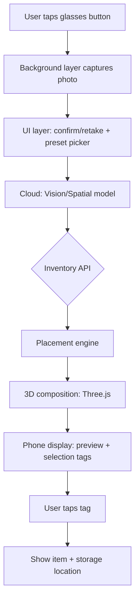

# Spatial Inventory AR MVP — Hardware & System Spec

## 1. Product in one sentence

A hands-free camera-glasses experience that photographs an empty shelf or rack, suggests in-stock items that fit, shows a 3D mockup of the populated shelf on a phone screen, and lets the user tap a tag to see where the item is stored.

## 2. Is this doable in 4 hours?

**No for the full MVP, yes for a demo.** A real end-to-end AR/AI/inventory loop needs more than 4 hours. A **judge-friendly demo** is achievable if we fake the slowest pieces (real-time 3D generation and live inventory) and use pre-built models and a hardcoded inventory list.

## 3. Hardware target (assumption to validate)

**Assumption:** Mentra Live camera glasses. If you are using a different model, this spec must be updated.

### Mentra Live confirmed specs

| Spec | Value |
|---|---|
| Weight | 43g |
| Dimensions | 162 L × 148 W × 47 H mm |
| Chipset | MediaTek MTK8766 + low-power MCU |
| OS | MentraOS (open source) |
| Camera | 12MP stills (3264 × 2448), 1080p video |
| Field of view | 119° landscape |
| Audio | 3 microphones, stereo speakers |
| Connectivity | Bluetooth (phone), Wi-Fi, Infinity Cable power |
| Battery | 260mAh, 12+ hours; charging case adds 50+ hours |
| Display | **None** |

### Hardware implications

- **No in-glass AR overlay.** Selection “tags” and the 3D preview must render on the phone screen (or be described via audio).
- The user will likely hold the phone to see the preview while the glasses capture the scene.
- The app is a **Mentra miniapp** with:
  - A `background` layer for camera/button capture.
  - A React `ui` layer for the phone screen.
- For a 4-hour demo, upload a single still photo, not a live video stream.

## 4. System architecture



## 5. 4-hour demo flow

1. User points the glasses at an empty rack or closet.
2. Taps a glasses button to capture a still photo.
3. Phone app shows the photo and a few preset filters (closet, retail shelf, warehouse rack, etc.).
4. User taps **Generate**.
5. Cloud returns 3–5 suggested items and placement coordinates.
6. Phone renders a Three.js scene with items placed on the shelf.
7. User taps an item tag; app shows name, image, and storage unit/bin.

## 6. Tech stack (tentative)

| Layer | Tool |
|---|---|
| Glasses app | `@mentra/miniapp` (Bun + TypeScript + React UI) |
| Image / scene understanding | OpenAI `gpt-6-astra` or `gpt-4-vision` |
| 3D assets | Tripo, Mint, or pre-built GLB placeholders |
| World model (optional) | World Labs Atlas / Marble if early access is approved; otherwise 2.5D compositing |
| Inventory / backend | Convex, Airtable, or a JSON stub |
| Object storage | S3 / R2 / Cloudflare for photos and models |
| Phone UI | React WebView inside Mentra miniapp |

## 7. Phone UI wireframe

```
+------------------+
|  [Photo preview] |
|  [Retake]        |
+------------------+
|  [Closet][Shelf] |
|  [Retail][Other] |
+------------------+
|  [Generate]      |
+------------------+
|  3D Preview      |
|  + item tags     |
+------------------+
|  Tap tag ->      |
|  Name, Bin, Unit |
+------------------+
```

## 8. Open questions to close before coding

1. Which glasses model are you actually using? (Mentra Live, Even Realities, Vuzix, etc.)
2. What is the inventory system? (Convex, Airtable, Shopify, SQL, etc.)
3. What does an inventory record look like? (sku, name, dimensions, category, 3d model url, storage unit, bin, available qty)
4. Do items already have 3D models/GLBs, or should we generate them on the fly?
5. Which AI API keys and credits do you already have? (OpenAI Astra, World Labs, Tripo, Mint)
6. What are the user “preset” filters? (style, room type, category, color, etc.)
